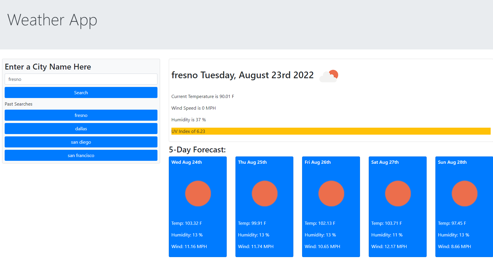

# Weather App - Bootcamp Module 6 Challenge

## Weather Application for viewing current weather and weather forecast for cities using Open Weather API

## Technologies used
- JavaScript
- JQuery
- Bootstrap

## Link to Live URL
https://ckavanattu.github.io/Module6-WeatherApp/

## Sample Screenshot Below!

